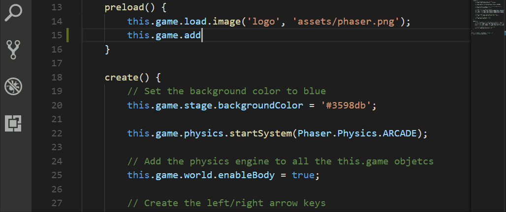

# Simple Phaser Typescript Development Example

Develop phaser-ce games with typescript. This allow code completion with comments



Module importation is made with RequireJs

## Install Global Dependencies
```
npm install -g typescript
npm install -g http-server
```

## Clone this repo
```
git clone https://github.com/julien-riel/phaser-typescript.git
cd phaser-typescript
npm install
npm start
```

## Open your browser
 
 Goto [http://localhost:8080/index.html](http://localhost:8080/index.html) and you're ready to go!